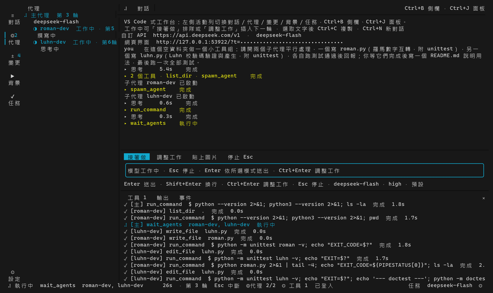
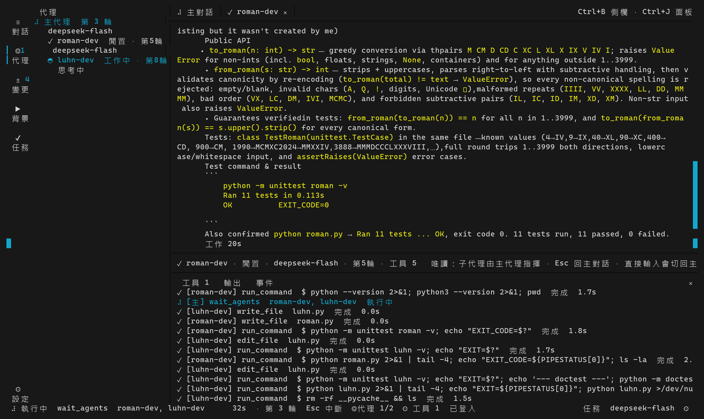
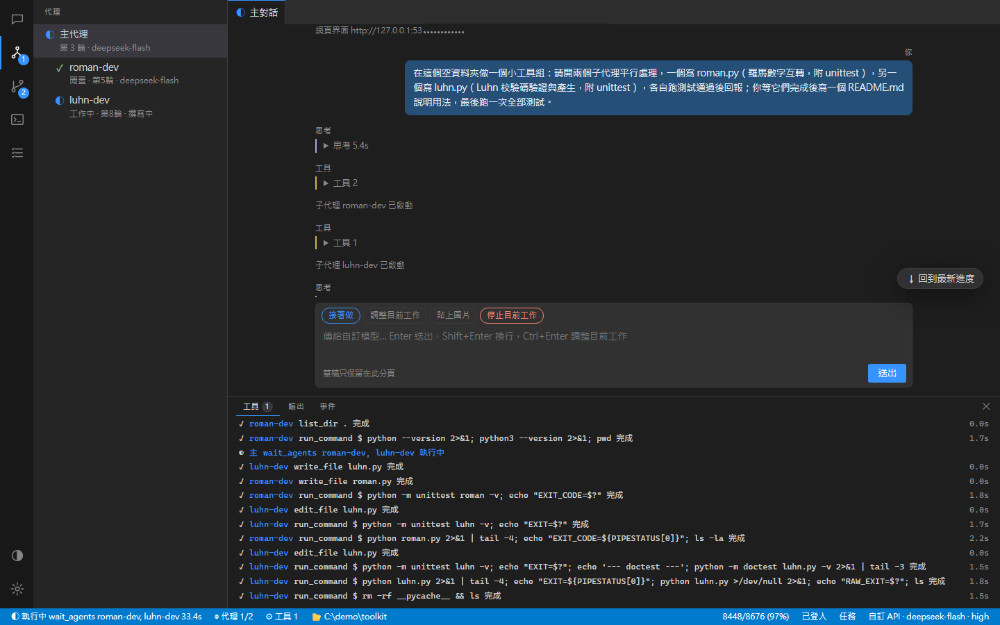

# grokaagent

在終端機裡工作的 AI 代理：一個主代理規劃並親手改檔、跑指令，需要時開子代理平行處理；終端 TUI 和瀏覽器看到的是同一個工作台。可用 Grok 訂閱登入，或任何 OpenAI 相容 API（DeepSeek 等）。



## 特色

- **VS Code 式工作台**：左側代理樹（主代理／子代理／孫代理與即時狀態）、每個子代理一個唯讀分頁、底部工具時間軸。TUI 與網頁即時同步，網頁有深色／淺色主題。
- **子代理**：主代理用 `spawn_agent` 開子代理後繼續工作；子代理是長壽 session，記得先前的指示，完成後自動回報。
- **兩種模型來源，可混用**：Grok（SuperGrok／X Premium+ 帳號登入）或 OpenAI 相容端點；主代理與子代理可用不同模型。非 Grok 模型也能透過 `grok_search` 借用 Grok 搜尋網路與 X。
- **每個系統都用 bash**：Windows 上用 Git Bash，沒裝 Git 時自動下載 busybox；需要時仍可指定 `cmd` 或 `powershell`。
- **長時間工作**：上下文快滿時，由模型自己把舊內容整理成長期記憶，最近的內容原文保留；模型服務暫時出錯會自動重試。
- **安全預設**：會離開工作區或有風險的複合指令先經獨立審查；改檔一律用差異或精確取代，不會整檔覆寫。

| 子代理分頁（唯讀，完整工作紀錄） | 網頁工作台（深色主題） |
|---|---|
|  |  |

## 安裝

不需要 Rust。腳本會下載 GitHub Release、核對 SHA-256，安裝到 `~/.grokaagent/bin`。

```powershell
# Windows（amd64）
irm https://github.com/jason920612/grokaagent/releases/latest/download/install.ps1 | iex
```

```sh
# Linux（amd64）／macOS（Apple Silicon）
curl -fsSL https://github.com/jason920612/grokaagent/releases/latest/download/install.sh | sh
```

之後會自動更新（啟動時檢查，最多每 6 小時一次）；也可以手動 `grokaagent update`。

## 開始使用

在專案資料夾執行：

```sh
grokaagent
```

第一次使用按 `F2` 開設定：

- **Grok**：按「登入 Grok」，在瀏覽器核准即可。
- **自訂 API**：切到「自訂 API」，填端點、金鑰、模型與上下文大小。也可以直接用參數：

  ```sh
  grokaagent tui --base-url https://api.deepseek.com/v1 --api-key sk-... --model deepseek-flash --context 1M
  ```

不開介面、一次性執行：

```sh
grokaagent run "列出這個專案的 TODO，整理成 todo.md"
```

事件會寫到 `groka-events.jsonl`，可以用自己的腳本讀。

## 常用按鍵

| 按鍵 | 作用 |
|---|---|
| `Enter` / `Shift+Enter` | 送出／換行 |
| `Ctrl+Enter` | 在模型工作中插入調整（下一輪生效） |
| `Esc` | 停止目前工作（子代理也會停下，但保留記憶） |
| `F2` | 設定 |
| `Ctrl+B` / `Ctrl+J` | 側欄／底部面板 |
| `Alt+1`–`Alt+5` | 對話、代理、變更、背景、任務 |
| `Alt+0` / `Alt+↑↓` | 回主對話／切換子代理分頁 |
| `Ctrl+N` / `Ctrl+Q` | 新對話／離開 |

TUI 啟動時會顯示網頁版網址（只接受本機連線，網址帶每次啟動產生的 token）。

## 環境變數

| 變數 | 用途 |
|---|---|
| `GROKA_NO_UPDATE=1` | 關閉自動更新 |
| `GROKA_BASH` | 指定 bash 路徑，或 `busybox` 強制使用內建 busybox |
| `GROKA_CONTEXT_WINDOW` | 覆寫上下文大小，例如 `262K` |
| `GROKA_GROK_SEARCH_MODEL` | `grok_search` 使用的 Grok 模型 |
| `GROKA_INSTALL_DIR` | 安裝腳本的安裝位置 |
| `GROKA_XAI_AUTH_FILE` | Grok 登入檔位置（預設 `~/.grokaagent/xai-auth.json`，不要 commit） |

## 開發

```sh
cargo build
cargo test
cargo run            # TUI
cargo install --path . --force --locked
```

`evals/` 是真實任務評測（短任務、長任務、專業領域，隱藏評分），用來比較模型與框架改動：

```sh
python evals/run.py --models grok-4.7,deepseek-flash-official
python evals/report.py evals/results/<時間戳記>
```

架構說明在 [docs/adr](docs/adr)。

## License

[MIT](LICENSE)
